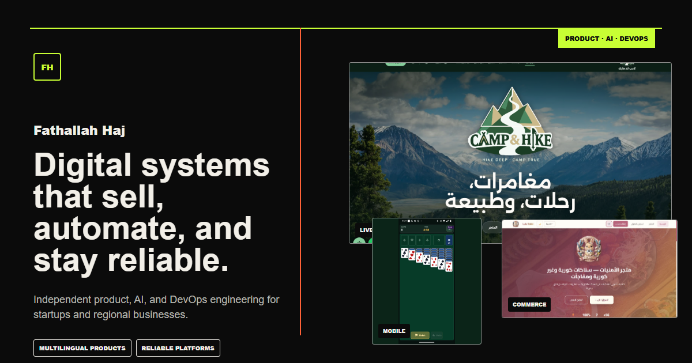

# Fathallah Haj Portfolio

Customer-first portfolio for [Fathallah Haj](https://fhaj.vercel.app), an independent product and DevOps engineer building multilingual products, AI automation, and reliable cloud platforms.



## What is included

- English, Arabic, and Hebrew routes with RTL/LTR layouts and localized metadata
- Real product case studies and approved public-facing screenshots
- Customer-focused service paths for product delivery, AI automation, and platform reliability
- Project brief delivery through a validated Next.js Server Action and Resend
- Vercel Analytics, Speed Insights, sitemap, robots rules, and structured data
- Reduced-motion support and responsive layouts for desktop and mobile

## Local development

```bash
npm install
npm run dev
```

Copy `.env.example` to a local environment file and configure `RESEND_API_KEY` to enable project-brief delivery. Without it, the interface reports delivery as unavailable and keeps the direct email and WhatsApp paths visible.

## Verification

```bash
npm test
npm run lint
npm run build
```

## Content boundaries

Public repository links are included only for public source. Private product code, administration surfaces, credentials, customer data, and sensitive systems are intentionally excluded. Case studies do not claim employers, customers, scale, revenue, or outcomes that are not supported by the referenced evidence.
